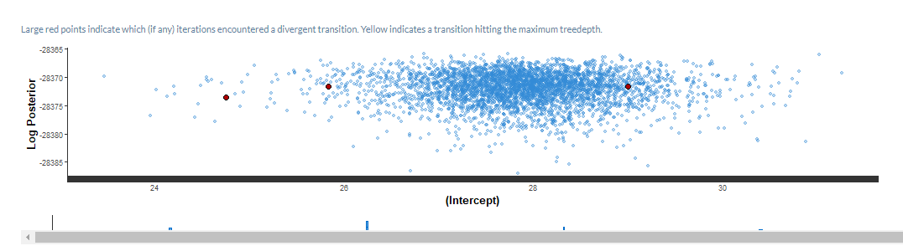

```{r, echo = FALSE, warning = FALSE, message = FALSE}
library(tidyverse)
```

# What problem do we solve with survey weighting?

```{r, echo=FALSE,out.width="5%", out.height="5%"}

knitr::include_graphics(rep("../images/cat_black.png",100))


knitr::include_graphics(rep("../images/dog_black.png",100))

```

--

Do you like cats?

---

# What problem do we solve with survey weighting?

```{r, echo=FALSE,out.width="5%", out.height="5%"}

knitr::include_graphics(rep("../images/cat_black.png",25))
knitr::include_graphics(rep("../images/cat_red.png",75))

knitr::include_graphics(rep("../images/dog_black.png",75))
knitr::include_graphics(rep("../images/dog_red.png",25))
```

--

50% of the population likes cats

---

# What problem do we solve with survey weighting?

```{r, echo=FALSE,out.width="5%", out.height="5%"}

knitr::include_graphics(rep("../images/cat_black.png",4))

knitr::include_graphics(rep("../images/dog_black.png",16))
```

--

Do you like cats?

---

# What problem do we solve with survey weighting?

```{r, echo=FALSE,out.width="5%", out.height="5%"}

knitr::include_graphics(rep("../images/cat_black.png",1))
knitr::include_graphics(rep("../images/cat_red.png",3))

knitr::include_graphics(rep("../images/dog_black.png",12))
knitr::include_graphics(rep("../images/dog_red.png",4))
```

--

35% of the sample likes cats

---

# Weights adjust the sample to the population

- This means that each cat would be weighted by 25, and each dog would be weighted 6.25 

--

- You can interpret this as each cat "counts" as 25 cats, and each dog "counts" as 6.25 dogs

--

- To estimate the total cat preference in the population, we would calculate:

Likes cats = 3x25 + 4x6.25

Likes cats = 100 

Likes cats = 1x25 + 12x6.25

Likes cats = 100

--

- This means our estimate of the proportion who like cats is 50%, which is the population proportion 

---

# MRP makes predictions into the population

- This means we model the outcome (likes cats) by the demographics (dog or cat) using our sample
--

- To estimate the total cat preference in the population, we would calculate:

pr(Likes cats|cat) = .75

pr(Likes cats|dog = .25

N cats in population = 100 (est 75 like cats)

N dogs in population = 100 (est 25 like cats)

Total % of population that likes cats = (25+75)/(100+100) = 50%

--

- Ties to  multiple imputation, potential outcomes, forecasting etc. 

---

# More formally

- Estimate the probability of the outcome given demographic variables using a multilevel model

--

$$p(y_i=1|\texttt{age_group, sex})$$ 
$$= logit^{-1}(\beta_0 + \alpha_{\texttt{agegroup}[i]} +\alpha_{\texttt{sex}[i]})$$ 
--

$$\alpha_{\texttt{agegroup}} \sim N(0,\sigma_{\texttt{agegroup}}^2)$$

$$\alpha_{\texttt{sex}} \sim N(0,\sigma_{\texttt{sex}}^2)$$


---

# Post stratification (survey weighting)

- Create weights that adjust the sample $n_j$ to the population $N_j$

--

- In a simple case, it looks like this:

```{r, echo = FALSE, message = FALSE, warning = FALSE}
library(kableExtra)

kable(data.frame(Age = c("18-25","26-45" , "46+", "18-25","26-45" , "46+"), 
                 Sex = c(rep("F",3),rep("M",3)), 
                 n = c("n1","n2","n3","n4","n5", "n6"), 
                 N = c("N1","N2","N3","N4","N5", "N6"),
                 wt = c("N1/n1","N2/n2","N3/n3","N4/n4","N5/n5","N6/n6")))

```
---


# Post stratification (MRP)

- Predict for each cell the probability of the outcome $y$

--

- In a simple case, it looks like this:

```{r, echo = FALSE, message = FALSE, warning = FALSE}
library(kableExtra)

kable(data.frame(Age = c("18-25","26-45" , "46+", "18-25","26-45" , "46+"), 
                 Sex = c(rep("F",3),rep("M",3)), 
                 n = c("n1","n2","n3","n4","n5", "n6"), 
                 N = c("N1","N2","N3","N4","N5", "N6"),
                 pr_y = c("p1","p2","p3","p4","p5","p6")))

```

--

-  Then create population estimates using this formula, where j is denoted the row in the poststratification matrix

$$\hat{\theta} = \frac{\sum_{j=1}^J\theta_j * N_j}{\sum_{j=1}^JN_j}$$
---

# In R

- In this example we are going to predict the average amount of extroversion in the US population (aged 13+) using our online websample. 

--

- There's a couple of data specific challenges to note. 

--

  - education was not measured at all
  
  - ethnicity was measured using levels that do not map easily to the US census measurement
  
  - gender was measured instead of sex, with three categories. We remove those who don't respond male/female for simplicity, but this is absolutely not best practice. See https://arxiv.org/abs/2009.14401 for more details on the decision process. 
  
  - All of the psychological measures are scales with discrete lower and upper bounds. In the manuscript we use a truncated normal regression (implemented through brms), but today we will use just a regular linear regression

---

# Run a model estimating neuroticism

```{r}

clean_data  <- readRDS("../data/cleaned_data_mrp.rds")

```

- Use rstanarm to fit a regression model that predicts the outcome, using random effects for demographics with greater than one level

```{r, message = FALSE, warning=FALSE}
library(rstanarm)

```

```{r, cache = TRUE}
model_fit <- stan_glmer(N ~ (1|age_group) + female,  data = clean_data)

```
There were a few divergent transitions, we can use shiny stan to explore further

```{r, eval = FALSE}
library(shinystan)
launch_shinystan(model_fit)
```

---

```{r, echo=FALSE,out.width="100%", out.height="20%"}



```

---

# Adapt the model 

- Change adapt_delta to decrease the step size and reduce the divergent transitions (generally if this reduces the transitions then it's fine to continue)

```{r, cache = TRUE}
library(rstanarm)
model_fit_v2 <- stan_glmer(N ~ (1|age_group) + female,  data = clean_data, adapt_delta =  .95)

```

---

# Make population poststratification predictions

- Read in the population poststratification matrix

```{r}
popn_ps <- readRDS("../data/acs_ps.rds")

popn_ps
```
---

# Make population poststratification predictions

- Use `posterior_epred` to make population predictions

- Use `posterior_linpred(transform = TRUE)` for binomial models

- Use `posterior_predict` to predict potential values, not expected potential values

```{r}

popn_preds <- posterior_epred(model_fit_v2, newdata = popn_ps)

```

--

- What size do we get back?

```{r}
dim(popn_preds)
```
--

- So we get a $4000$ predictions for each cell in the poststratification matrix
---

# Estimating uncertainty

- The $4000$ predictions correspond to each posterior sample for the parameters in the model.

--

- Together they form a *posterior predictive* distribution

--

- We can use quantiles of this distribution to create estimates of uncertainty around our estimates. 


---

# Making population estimates

- Generally we don't want a posterior estimate for every cell. Instead we might like to aggegate over the cells to create population or sub population estimates. 

--

- We will focus on making a population estimate for the mean neuroticism

--

```{r}
popn_ests <- t(popn_preds) %>% #make the rows the poststrat options
  cbind(popn_ps) %>% #join the poststratification_matrix 
  pivot_longer(c(-female,-age_group,-N),
               values_to = "preds",
               names_to = "posterior_samp") %>%
  group_by(posterior_samp) %>% # for each posterior sample
  summarise(popn_est_N = sum(N*preds)/sum(N)) %>% #MRP formula
  ungroup()

head(popn_ests)

```

---

# Estimating uncertainty

- Now we have $4000$ estimates for the mean of the posterior. As we've seen, we can take the posterior median, but how can we use quantiles to estimate uncertainty?

--

```{r}
popn_ests %>%
  summarise(lower_10 = quantile(popn_est_N, .1),est = median(popn_est_N), upper_90 = quantile(popn_est_N, .9))
```

--

- What is the sample mean?

```{r}
clean_data %>%
  summarise(mean(N))
```

--
- Generally it's good to us 10-90 intervals because estimates of 2.5-97.5 intervals can be noisy due to the number of samples in the tails


---

# Are those intervals particularly narrow?

- Potential reasons

  - Lots of data (>8000 observations)
  
  - Very simple model (only two adjustments)
  
  - Estimating the mean (rather than the potential outcomes)

---

# What about sub population estimates? 

- Sub-population estimates can be calculated using the same model fit, but we aggregate over smaller sections of the population

--

- We can see that to do this we would add in extra grouping variables. 

```{r}
t(popn_preds) %>% #make the rows the poststrat options
  cbind(popn_ps) %>% #join the poststratification_matrix 
  pivot_longer(c(-female,-age_group,-N),
               values_to = "preds",
               names_to = "posterior_samp") %>%
  group_by(posterior_samp, female) %>% # for each posterior sample
  summarise(popn_est_N = sum(N*preds)/sum(N)) %>% #MRP formula
  ungroup() %>%
  group_by(female) %>%
  summarise(lower_10 = quantile(popn_est_N, .1),est = median(popn_est_N), upper_90 = quantile(popn_est_N, .9))

```
---

# MRP vs survey weighting

- Survey weighting puts the burden of sample adjustment on the survey statistician (i.e., they think deeply about sampling and non-response, create weights and then export weights with the data)

- MRP puts the burden of sample adjustment on the analyst (i.e., they need to identify relevant variables to adjust for, find them in the population and run complex models and prediction to make simple estimates)

--

- Survey weights are designed for specific use cases or populations 

- MRP uses the same model to make predictions for different populations

--

- Survey weights are generic for the variables in the survey (I can use the same weights to estimate different outcomes)

- MRP is run specific for a given outcome. If you want to make estimates for a different outcome, you need to run a different model. 

---

# MRP and designed surveys

-  Many of the MRP examples rely on non-probability type surveys where the only necessary adjustment is poststratification

--

- Ignoring sampling design is not advised

--

- How can sampling design be included in MRP models (this is a research area and might change!)

--

1. If the sampling design variables are known in the population (for example, clusters or strata), then they can be included in the MRP model as predictors

2. If the sampling design variables are NOT included in the population, you can try to impute it in the population, or else use weights within your MRP model (see Si et al., 2017). 

---

# What should we adjust for?

1. Demographic variables that relate to the outcome of interest

2. Demographic variables that relate to non-response

OR Demographic variables that fulfill both?

---

# Extensions

- Consider fitting more advanced models (truncated regression, splines, AR(1)/random walk, BYM2 etc) models using brms
(Hint: Install cmdstanr and use brms with a cmdstanr backend for easier installation)

--

- Explore using deeper interactions between your adjustment variables

--

- Little 1993 - the relationship between poststratification and modelling 

--

- Working with complex measurement models with MRP (see Chris Warshaw's work with IRT https://www.cambridge.org/core/journals/political-analysis/article/abs/dynamic-estimation-of-latent-opinion-using-a-hierarchical-grouplevel-irt-model/6EBDF2FC39CEEEE1108CEC799FC9B7BC and Marta Kolczynska for a brms implementation https://osf.io/preprints/socarxiv/3v5g7/)