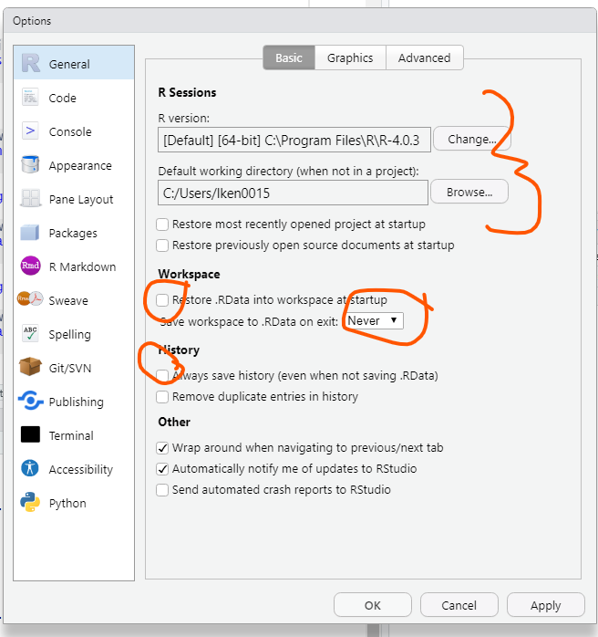

```{r, echo = FALSE, warning = FALSE, message = FALSE}
library(tidyverse)
```


# Why use R?

- R is an opensource software designed for and used by statisticians and datascientists

--

- It has intuitive packages for data munging, visualization and modelling

--

- R makes data science accessible

--

  - Welcoming communities 
  
  - "Growth mindset" - Learning and developing as a coder and data scientist is encouraged with resources, support and enthusiasm
  
  - Reproducible code is an excellent learning resource
  
  - Shiny apps and other tools provide a way to create code-free data communication
--

- R has packages and support for the survey methods we will work with over the next two days

---

# Getting started in R

R vs R Studio?

- R is the language

- Rstudio is the interface that we use to interact with R (always use R studio)

Four panes:

```{r echo=FALSE, out.height="75%", out.width= "75%"}

```

---
# Customizing Rstudio (a few tricks)

```{r echo=FALSE, out.height="100%", out.width= "100%"}

```

---

# Use global options to change a few things

```{r echo=FALSE, out.height="100%", out.width= "100%"}

```

---

# Use global options to stop R from asking if you want to save history

```{r echo=FALSE, out.height="100%", out.width= "100%"}

```

---

# Change the theme

```{r echo=FALSE, out.height="100%", out.width= "100%"}

```

---

# Ways to have a reproducible workflow

1. Reproducible code for end to end analysis (including cleaning)

--

2. Shareable file structure

--

3. Open, well documented data (or clear instructions on data origins)

--

4. Easily updated reports 


---

# R projects

- One of the difficulties of working with code based analysis is that it exposes the file system.

--

- Files are referenced from the current working directory, which means the current working directory (often long, and different between different computers) needs to be specified. 

--

- R projects are a great solution to specifying long file paths in code.

--

- For every new collection of work that uses similar resources (like data), start by creating a project (File > New Project)

--

- This will create a folder, with a file called "foldername.Rpoj". Every time you want to work on this project, make sure the project is open first!

--

- If you want to share your work, you can simply zip the entire project folder and email it to a collaborator (or push it to Github) - because the file structure is relevant to the project, it will all work for them straightaway!

---
   
# Setting up your project directory

- It's generally good practice to create a few folders within your project too. For the workshop, you might want to set up a folder for analysis (where you'll store your code from each practical component), and a folder to store your data. 

- Other things in your project should include the project file (extension Rproj) and a read me file (where you can write notes on what this project is for future you).
   
```
SurveyWorkshop
├── README.md
├── analysis
│ └── workshop1.Rmd
│ └── workshop2.Rmd
│ └── workshop3.Rmd
│ └── workshop4.Rmd
├── data
│ └── data.csv
└── SurveyWorkshop.Rproj
```
---


# Rscripts and Rmarkdown

- R scripts are a list of commands that conduct a particular task

--

- They need to be run from the top to the bottom

--

- Any text or notes made for the human reader are made using comments, marked with '#'

--

- Rmarkdowns are reports that incorporate chunks of code spaced with text (which can be formatted)

--

- They are "knitted" to produce a word, pdf or html, complete with figures and tables. 

--

- You can do a lot with an rmarkdown - these slides are written in rmd! 

--

- Rmarkdown is useful to create reproducible reports, but they can be slow to run if Bayesian

---

# Drake

- One workflow solution to slow to compile reports is Drake.

--

- This is an analysis workflow that looks to see if previous stages have been changed (e.g., a change in data) 

--

- If they have, then current and future stages are triggered (such as rerunning models or recreating figures/tables)

--

- This can be a good solution for an R workflow that incorporates large analytic projects or small projects that require intensive computation time.

--

- We won't implement this in this course, but there are useful help guides if you're interested!

---

# R packages

- One of the great strengths of R is the number of opensource packages that have been written to support various applications.

--

- Many of these packages are hosted on CRAN, which enforces particular standards

--

- Install packages from CRAN using the tab in your lower rhs panel, or use the command

```{r, eval = FALSE}

install.packages("survey")

```


---

# R packages

- We will use a few popular packages throughout this workshop, here's quick summary:

--

  - tidyverse: a collection of packages that work well together for simple and complex data munging and other data work
  
  - survey: a package that does traditional survey weighting analysis and creation

  - rstanarm: run a selection of precompiled Bayesian models in Stan
  
--

-  Here are some others that we might use (if we have time) and if not are good to know about:

--

  - ggplot2: make cool plots 
  
  - knitr and kableExtra: make Rmarkdown documents and nicely formatted tables
  
  - brms: Fit a wider variety of models (splines, spatial models etc) using Stan
  
  - lme4: Fit multilevel models approximately (very fast, more complex models might have convergence issues, no priors)
  
  - INLA: Fit a variety of models using Nested Laplace Approximation (can be a little difficult to use, but fast)
  
---

# Getting started: Loading packages 

1. Open R studio

2. Open your project (File > Open Project > Select project)

3. Create a new Rmarkdown file (File > New > Rmarkdown)

4. In the first chunk of R code, load all of the packages you intend to use using the code:


```{r, eval = FALSE}
library(survey)
```

5. If you have a package installed, but don't want to load it (because of name clashes or because you only intend to use one function, you can use the :: operator to index it)

```{r, eval = FALSE}
survey::function_of_survey_package(input)
```

---

# Getting started: Import Data

- If you have a choice for how data is given to you, .csv is a good file format for moving between languages.

--

- However, by using the haven package, you can import data in proprietary data structures (e.g., SAS. Stata, etc) and work with them in R.

--

-  A convenient shortcut is to use the Rstudio GUI, which provides a quick view of the data you are importing. To use this. Navigate to your data in the bottom right panel, left hand click the data and select "import data".

--

```{r echo=FALSE, out.height="60%", out.width= "60%"}
knitr::include_graphics("../images/Import_Data.png")
```

---

# Getting started: Data munging

- Survey data is really messy

--

- Working with survey data requires extensive data manipulation skills

--

- In R, there are two options:

1. Base R - Manipulation using indexing, and by applying functions across a dataframe

2. Tidyverse package family - manipulation using pipes %>% to chain functions together

--

- We will be using the second as it's often more accessible to folks who are new to R, but the first is equally fine
---

# Data munging: Filter


```{r echo=FALSE, out.height="100%", out.width= "100%"}
knitr::include_graphics("../images/dplyr_filter.jpg")
```

Illustrations from the Openscapes blog Tidy Data for reproducibility, efficiency, and collaboration by Julia Lowndes and Allison Horst

---
# Data munging: Select

- Use select to find reduce your data frame to a set of columns


```{r, eval = FALSE}
new_data <- data %>%
  select(X1)
# new_data has one column, X1

new_data <- data %>%
  select(starts_with("X"))
# new_data has all columns that start with X

new_data <- data %>%
  select(!X6:X10)
# new_data has all columns except X6 through to X10 (even if the variables in between X6 and X10 are X12)
```


---

# Data munging: mutate

```{r echo=FALSE, out.height="50%", out.width= "50%", fig.align='center'}
knitr::include_graphics("../images/dplyr_mutate.png")
```

Illustrations from the Openscapes blog Tidy Data for reproducibility, efficiency, and collaboration by Julia Lowndes and Allison Horst

---

# Data munging: Group by and summarise

- One of my favourite combinations! Obtain a summary statistic by group(s)

```{r, eval = FALSE}
new_data <- data %>%
  group_by(age_group, gender) %>% 
  summarise(Y_mean = mean(Y))%>%
  ungroup()
# produce the mean of all age_group/gender combinations
```

---

# Data munging: Wide to long and long to wide

- Survey data is often given in a *wide* format, where one respondent is represented by one row

--

- It's generally much easier in R to work with a *long* format, where one observation is represented by one row (i.e., a participant is represented by multiple rows)

--

- Moving from wide to long and long to wide used to be really difficult, until the introduction of the tidyverse pivot_wider and pivot_longer

---

# Data munging: Wide to long and long to wide

```{r echo=FALSE, out.height="50%", out.width= "50%", fig.align='center'}
knitr::include_graphics("../images/tidyr_spread_gather.png")
```

Illustrations from the Openscapes blog Tidy Data for reproducibility, efficiency, and collaboration by Julia Lowndes and Allison Horst

---

# Putting it all together:

```{r, echo = FALSE}
ex_data <- data.frame(age = rnorm(100,50,10),
                      gender = sample(c(1,2,3),100, replace =TRUE, prob = c(.49,.49,.2) ),
                      subject_id = 1:100,
                      pov_16 = sample(c(0,1),100, replace = TRUE, prob = c(.7,.3)),
                      pov_17 = sample(c(0,1),100, replace = TRUE, prob = c(.7,.3)),
                      pov_18 = sample(c(0,1),100, replace = TRUE, prob = c(.7,.3)),
                      happiness = rnorm(100,0,1))
```

```{r}
head(ex_data)
```

```{r, eval = FALSE}
new_data <- ex_data %>%
  #Remove happiness from the data 
  select(-happiness)%>%
  #Make our data long
  pivot_longer(pov_16:pov_18, names_to = "year", values_to = "poverty")%>%
  # mutate age to age group using 5 even age intervals
  mutate(age_group = cut_interval(age,5))%>%
  #summarise poverty for each age group/gender/year combo
  group_by(age_group, gender, year) %>% 
  summarise(percent_poverty = mean(poverty))%>%
  ungroup()
# produce the mean of all age_group/gender combinations
head(new_data)
```

---
#Putting it all together

```{r, echo = FALSE, warning = FALSE, message = FALSE}
new_data <- ex_data %>%
  #Remove happiness from the data 
  select(-happiness)%>%
  #Make our data long
  pivot_longer(pov_16:pov_18, names_to = "year", values_to = "poverty")%>%
  # mutate age to age group using 5 even age intervals
  mutate(age_group = cut_interval(age,5))%>%
  #summarise poverty for each age group/gender/year combo
  group_by(age_group, gender, year) %>% 
  summarise(percent_poverty = mean(poverty))%>%
  ungroup()
# produce the mean of all age_group/gender combinations
head(new_data)
```

---

# Getting started: How to save

- R studio asks (by default) if you'd like to save your environment. The correct answer is no! (We turned off this option earlier)

--

- The best way to create a reproducible workflow is to use projects, rmarkdowns and scripts to produce reproducible results

--

- Sometimes (particularly if Bayesian) results can take a long time get or you might want to save intermediate steps (like cleaned data or model outputs)

--

- Save data by using RDS format:

```{r, eval = FALSE}

saveRDS(new_data, file = "/data/cleaned_data.rds")

```

--

- Save plots created in ggplot using ggsave

```{r, eval = FALSE}

ggsave(file = "/data/new_plot.png", example_plot)

```

---

# Communites and where to get help

```{r echo=FALSE, out.height="100%", out.width= "100%"}
knitr::include_graphics("../images/r_rollercoaster.png")
```

Illustrations from the Openscapes blog Tidy Data for reproducibility, efficiency, and collaboration by Julia Lowndes and Allison Horst

---

# Communites and where to get help

```{r echo=FALSE, out.height="75%", out.width= "75%", fig.align = 'center'}
knitr::include_graphics("../images/code_hero.jpg")
```


Illustrations from the Openscapes blog Tidy Data for reproducibility, efficiency, and collaboration by Julia Lowndes and Allison Horst

---

# Communities and where to get help

- ?function in R will help you access the help guides and documentation for that function.

--

- Rstats on Twitter (hashtag)

--

- R ladies (international with many local meetings) \url[https://rladies.org/]

--

- R studio community \url[https://community.rstudio.com/t/welcome-to-the-rstudio-community/8]

--

- Stack overflow \url[https://stackoverflow.com/questions/tagged/r]

--

- UseR! conference (annual, \url[https://user2020.r-project.org/])

--

- R Studio conference \url[https://www.rstudio.com/conference/]

--

- R bloggers \url[https://www.r-bloggers.com/]

--

- Local groups

- And many more!

